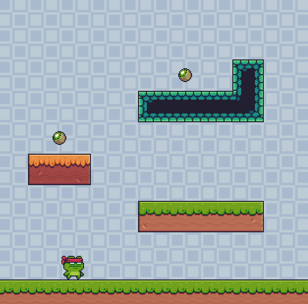

# Pygame-Platformer
a simple 2d platformer written in python pygame

- Level system implemented with Tiled and pytmx (to read the tiled data)
- Assets can be found at: https://pixel-frog.itch.io/pixel-adventure-1
- Homemade collision system (not using default pygame collision)
- Basic state management (not very pretty, but simple start screen)

_____

